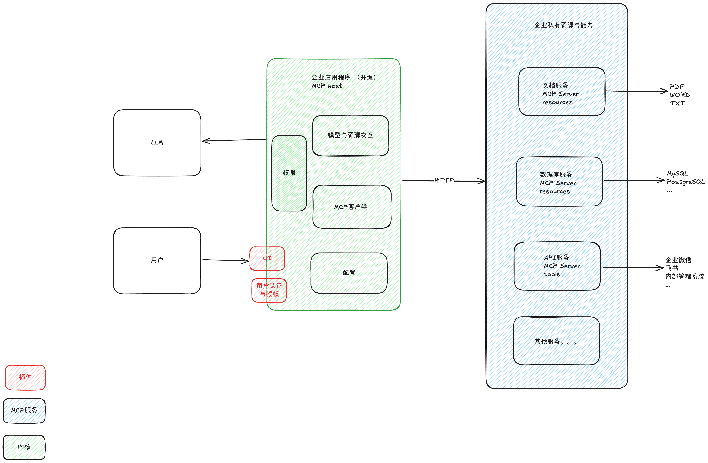

# Deepdesk
[](https://github.com/moguyn/deepdesk/actions/workflows/ci.yml)
[](https://codecov.io/gh/moguyn/deepdesk)

## Overview
Deepdesk is a platform for creating and managing AI agents for enterprise use cases. It provides organizations with the ability to leverage AI capabilities while maintaining control over their data and infrastructure.

## Purpose
- Create and manage AI agents for enterprise-specific use cases
- Provide a chat interface for interacting with AI agents and enterprise private data sources
- Enable companies to create custom AI agents without the complexity of multiple data source integrations
- Maintain data privacy and security within company infrastructure

## Key Features
- Chat interface for AI agent interaction
- Integration with enterprise private data sources
- Industry-standard MCP protocol for agent communication
- Flexible model integration through adapters
- Support for local open-source LLMs within company VPC
- No vendor lock-in

## Architecture Highlights
- Uses MCP (Model Control Protocol) for standardized agent communication
- Modular adapter system for connecting to various LLM providers
- Secure infrastructure design keeping business data within company VPC

## System Architecture

This diagram shows an **enterprise application** (“MCP Host”) that coordinates:
1. **User**  
   - Accesses the system through a **UI**.  
   - Undergoes **User Authentication & Authorization** to ensure proper permissions.

2. **MCP Host**  
   - **Permissions**: Manages role-based access.  
   - **Model & Resource Interaction**: Handles requests between the LLM and enterprise resources.  
   - **MCP Client**: Communicates with backend MCP services over HTTP.  
   - **Configuration**: Stores and manages app settings.

3. **LLM**  
   - Performs language processing and generation tasks as needed.

4. **Enterprise Services**  
   - **Document Service**: Handles PDFs, Word, TXT, etc.  
   - **Database Service**: Connects to MySQL, PostgreSQL, etc.  
   - **API Service**: Provides internal enterprise APIs.  
   - **Other Services**: Additional enterprise capabilities.

**Data Flow**:  
User → UI → MCP Host (checks permissions) → MCP Client → Enterprise Services (via HTTP).  
The LLM is also invoked through the MCP Host for language-model tasks.


## Getting Started
### Prerequisites
- Java Development Kit (JDK) 23 or higher
- Maven (included via Maven Wrapper)
- Node.js with `npx` (required for MCP server)
- Python 3.13.x with uv package manager (required for MCP server)
- Set the following environment variables:
```shell
export OPENAI_API_KEY='your-openai-api-key'
export ANTHROPIC_API_KEY='your-anthropic-api-key'
export BRAVE_API_KEY="your-brave-api-key"
```


### Running the Application
To start the application locally:
```bash
./mvnw spring-boot:run
```

### Building the Executable JAR
To build an executable JAR file with SpringBoot:
```bash
./mvnw clean package
```
The resulting executable JAR will be created in the `target` directory with the name `deepdesk-<version>.jar`.

To run the executable JAR:
```bash
java -jar target/deepdesk-<version>.jar
```

### Running Tests
To run the test suite:
```bash
./mvnw test
```

## Native Builds

DeepDesk supports generation of native executables that can run without a JVM on Linux, macOS, and Windows.

### Building Native Executables Locally

#### Linux/macOS
```bash
# Make the script executable (first time only)
chmod +x build-native.sh

# Build the native executable
./build-native.sh
```

#### Windows
```batch
# Build the native executable
build-native.bat
```

The resulting native executable will be created in the `target` directory the name: `deepdesk`

### Automated Multi-Platform Builds

Native executables for all supported platforms are automatically built using GitHub Actions. The latest builds can be found in the GitHub Releases section of this repository.

### Requirements for Native Builds

To build native executables locally:
- GraalVM installation with native-image utility
- Java 17 or newer (Java 23 recommended)
- Maven 3.8+

## Security & Privacy
Deepdesk is designed with enterprise security in mind:
- Business data remains within company infrastructure
- Support for local LLM hosting in private VPCs
- No external data transmission required when using local models

## License
This project is licensed under the GNU Affero General Public License v3.0 (AGPL-3.0). This license ensures that:
- The software can be freely used, modified, and distributed
- Any modifications to the software must be made available under the same license
- Network use is considered distribution, requiring source code to be made available to users interacting with the software over a network
- Full license text can be found in the LICENSE file

For more information, visit: https://www.gnu.org/licenses/agpl-3.0.en.html